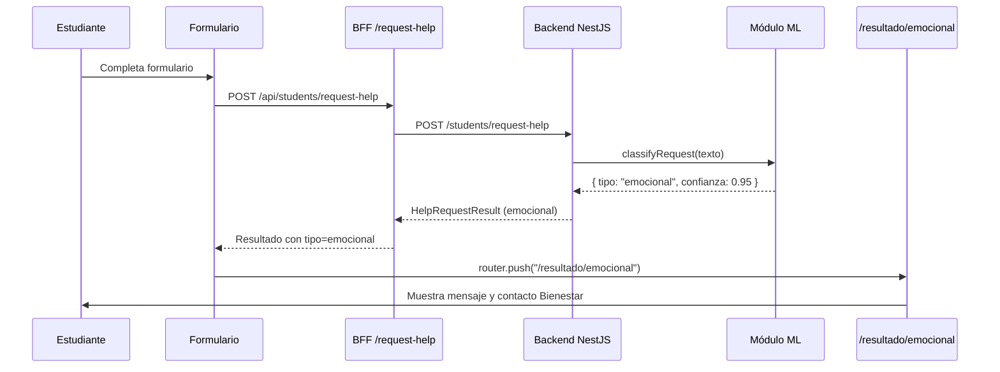
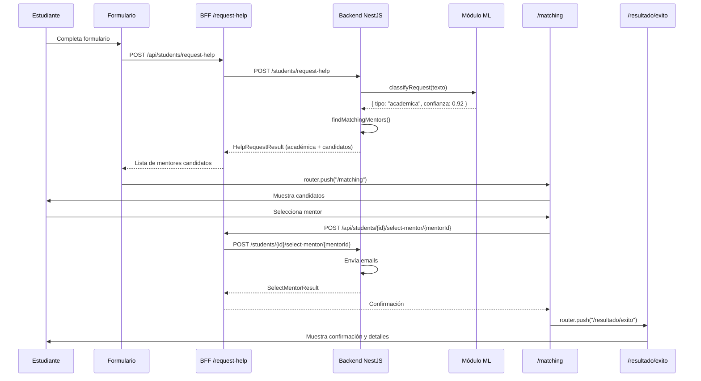

# 📋 Documentación Completa - Flujo de Triaje y Matching de Estudiantes

## 🎯 Resumen Ejecutivo

Sistema completo de triaje automático con IA que clasifica solicitudes de ayuda estudiantil como **académicas** o **emocionales**, realizando matching automático de mentores para casos académicos o derivando a Bienestar Estudiantil para casos emocionales.

---

## 🏗️ Arquitectura del Flujo

```
┌─────────────────┐
│   ESTUDIANTE    │
│  (Formulario)   │
└────────┬────────┘
         │
         ▼
┌─────────────────────────────────────┐
│ POST /api/students/request-help     │
│ (BFF Proxy)                         │
└────────┬────────────────────────────┘
         │
         ▼
┌─────────────────────────────────────┐
│ NestJS: POST /students/request-help │
│ • Guarda estudiante en BD           │
│ • Triaje ML (académica/emocional)   │
│ • Matching automático si académica  │
└────────┬────────────────────────────┘
         │
    ┌────┴────┐
    │ TRIAJE  │
    └────┬────┘
         │
    ┌────┴─────────┐
    │              │
    ▼              ▼
┌──────────┐  ┌─────────────┐
│EMOCIONAL │  │  ACADÉMICA  │
└────┬─────┘  └──────┬──────┘
     │               │
     ▼               ▼
┌──────────────┐ ┌───────────────────┐
│ /resultado/  │ │   /matching       │
│  emocional   │ │ (Lista candidatos)│
│              │ └────────┬──────────┘
│ • Mensaje    │          │
│ • Derivar a  │          ▼
│   Bienestar  │ ┌─────────────────────┐
└──────────────┘ │ Estudiante Selecciona│
                 │      Mentor          │
                 └──────────┬───────────┘
                            │
                            ▼
                 ┌────────────────────────┐
                 │ POST /students/{id}/   │
                 │  select-mentor/{id}    │
                 │ • Confirma match       │
                 │ • Envía emails         │
                 └──────────┬─────────────┘
                            │
                            ▼
                 ┌────────────────────────┐
                 │   /resultado/exito     │
                 │ • Confirmación         │
                 │ • Detalles del match   │
                 └────────────────────────┘
```

---

## 📁 Estructura de Archivos

### **Archivos Creados**

```
fronted-nextjs/src/
├── app/
│   ├── api/
│   │   ├── students/
│   │   │   ├── request-help/
│   │   │   │   └── route.ts                    ✨ NUEVO
│   │   │   └── [studentId]/
│   │   │       └── select-mentor/
│   │   │           └── [mentorId]/
│   │   │               └── route.ts            ✨ NUEVO
│   ├── resultado/
│   │   ├── emocional/
│   │   │   └── page.tsx                        ✨ NUEVO
│   │   └── exito/
│   │       └── page.tsx                        ✨ NUEVO
├── types/
│   └── index.ts                                🔄 MODIFICADO
└── services/
    └── api.ts                                  🔄 MODIFICADO
```

### **Archivos Modificados**

```
fronted-nextjs/src/
├── app/
│   ├── onboarding/student/page.tsx            🔄 MODIFICADO
│   ├── matching/page.tsx                      🔄 MODIFICADO
│   └── page.tsx                               🔄 MODIFICADO
├── components/
│   └── Navbar.tsx                             🔄 MODIFICADO
└── lib/
    └── schemas.ts                             🔄 MODIFICADO
```

---

## 🔄 Flujos Detallados

### **Flujo 1: Resultado Emocional**



**Datos mostrados:**
- ✅ Mensaje de comprensión
- ✅ Información de contacto de Bienestar Estudiantil
- ✅ Horarios de atención
- ✅ Confianza del triaje (%)

---

### **Flujo 2: Resultado Académico con Matching**



**Datos mostrados en /matching:**
- ✅ Lista de mentores candidatos
- ✅ Match score (%)
- ✅ Campus, carrera, especialidad
- ✅ Disponibilidad horaria
- ✅ Confianza del triaje

**Datos mostrados en /resultado/exito:**
- ✅ Confirmación de match exitoso
- ✅ Datos del estudiante
- ✅ Datos del mentor seleccionado
- ✅ Próximos pasos
- ✅ Mensaje de éxito

---

## 🔌 APIs y Endpoints

### **Frontend BFF (Backend for Frontend)**

#### 1. `POST /api/students/request-help`
**Descripción:** Proxy para procesar solicitud de ayuda con triaje automático

**Request Body:**
```typescript
{
  fullName: string;
  email: string;
  campus: "ANTONIO_VARAS" | "VINA_DEL_MAR" | "CONCEPCION";
  career: "CIVIL_ENGINEERING" | "COMPUTER_ENGINEERING" | "ELECTRICAL_ENGINEERING" | "INDUSTRIAL_ENGINEERING";
  currentYear: number;
  needs: string;
}
```

**Response:**
```typescript
{
  student: {
    id: number;
    fullName: string;
    email: string;
    campus: string;
    career: string;
    currentYear: number;
  };
  triaje: {
    tipo: "academica" | "emocional";
    confianza: number;
  };
  resultado: 
    | {
        tipo: "emocional";
        mensaje: string;
        accion: "derivar_bienestar";
      }
    | {
        tipo: "academica";
        mentores: MentorCandidate[];
        mensaje: string;
      };
}
```

#### 2. `POST /api/students/{studentId}/select-mentor/{mentorId}`
**Descripción:** Proxy para confirmar selección de mentor

**Response:**
```typescript
{
  student: {
    id: number;
    fullName: string;
    email: string;
  };
  mentor: {
    id: number;
    fullName: string;
    email: string;
  };
  mensaje: string;
}
```

---

## 📦 Tipos TypeScript

### **HelpRequestResult**
```typescript
export interface HelpRequestResult {
  student: {
    id: number;
    fullName: string;
    email: string;
    campus: string;
    career: string;
    currentYear: number;
  };
  triaje: {
    tipo: 'academica' | 'emocional';
    confianza: number;
  };
  resultado:
    | {
        tipo: 'emocional';
        mensaje: string;
        accion: 'derivar_bienestar';
      }
    | {
        tipo: 'academica';
        mentores: MentorCandidate[];
        mensaje: string;
      };
}
```

### **MentorCandidate**
```typescript
export interface MentorCandidate {
  id: number;
  fullName: string;
  email: string;
  matchScore: number;
  campus: string;
  career: string;
  specialtySubject: string;
  availability: string;
  bio?: string;
}
```

### **SelectMentorResult**
```typescript
export interface SelectMentorResult {
  student: {
    id: number;
    fullName: string;
    email: string;
  };
  mentor: {
    id: number;
    fullName: string;
    email: string;
  };
  mensaje: string;
}
```

---

## 🎨 Componentes UI

### **1. Formulario de Estudiante**
- **Ruta:** `/onboarding/student`
- **Componentes:** shadcn/ui (Form, Input, Select, Textarea, Button)
- **Validación:** Zod con `studentSchema`
- **Estado:** Loading durante envío
- **Redirección:** Automática según tipo de resultado

### **2. Página Resultado Emocional**
- **Ruta:** `/resultado/emocional`
- **Diseño:** Card con icono de corazón, mensaje empático
- **Información:** Contacto Bienestar, horarios, confianza
- **Animaciones:** framer-motion (fade-in, scale)

### **3. Página Matching**
- **Ruta:** `/matching`
- **Diseño:** Grid de cards de mentores candidatos
- **Información:** Match score, campus, especialidad, disponibilidad
- **Interacción:** Botón "Seleccionar Mentor" por cada candidato
- **Estado:** Loading durante selección

### **4. Página Éxito**
- **Ruta:** `/resultado/exito`
- **Diseño:** Card con icono de check, animación de celebración
- **Información:** Datos estudiante/mentor, próximos pasos
- **Acción:** Botón volver al inicio (limpia sessionStorage)

### **5. Navbar**
- **Cambios:** Eliminado "Iniciar Sesión" y links innecesarios
- **Links activos:** Solo "Acerca de"
- **Componentes:** Logo, ModeToggle (tema claro/oscuro)

---

## 💾 Gestión de Estado

### **SessionStorage**
Usado para persistir datos entre páginas del flujo:

```typescript
// Al recibir resultado de triaje
sessionStorage.setItem("helpRequestResult", JSON.stringify(result));

// Al seleccionar mentor
sessionStorage.setItem("selectMentorResult", JSON.stringify(result));

// Al volver al inicio (limpiar)
sessionStorage.removeItem("helpRequestResult");
sessionStorage.removeItem("selectMentorResult");
```

**Ventajas:**
- ✅ Datos temporales por sesión
- ✅ Se limpian al cerrar pestaña
- ✅ No persisten entre sesiones
- ✅ Ideal para flujos multi-página

---

## 🔒 Seguridad y Validación

### **Frontend (BFF)**
1. ✅ Validación Zod en todas las rutas
2. ✅ Sanitización de IDs (verificar que sean números)
3. ✅ Manejo de errores con try-catch
4. ✅ Mensajes de error descriptivos

### **Navegación Protegida**
```typescript
// Verificar que haya resultado antes de mostrar página
useEffect(() => {
  const storedResult = sessionStorage.getItem("helpRequestResult");
  if (!storedResult) {
    router.push("/"); // Redirect si no hay datos
    return;
  }
  // Verificar tipo de resultado
  if (parsedResult.resultado.tipo !== "academica") {
    router.push("/resultado/emocional");
    return;
  }
}, [router]);
```

---

## 🎯 Casos de Uso

### **Caso 1: Estudiante con Problema Emocional**
```
INPUT:
  needs: "Me siento muy estresado y ansioso con los exámenes. 
         No puedo concentrarme y tengo problemas para dormir."

TRIAJE ML:
  tipo: "emocional"
  confianza: 0.96

RESULTADO:
  → Redirige a /resultado/emocional
  → Muestra contacto de Bienestar Estudiantil
  → NO pasa por matching de mentores
```

### **Caso 2: Estudiante con Problema Académico**
```
INPUT:
  needs: "Necesito ayuda con Cálculo I, especialmente con 
         derivadas e integrales. No entiendo los ejercicios."

TRIAJE ML:
  tipo: "academica"
  confianza: 0.94

MATCHING:
  → Busca mentores con specialtySubject: "CALCULUS_I"
  → Filtra por campus y carrera
  → Ordena por match score

RESULTADO:
  → Redirige a /matching
  → Muestra 3 candidatos con scores: 0.98, 0.87, 0.76
  → Estudiante selecciona el mejor match
  → Redirige a /resultado/exito
  → Emails enviados a ambos
```

---

## 🧪 Testing

### **Verificaciones Manuales**
```bash
# 1. Build exitoso
npm run build
# ✅ Pasa sin errores
# ✅ 13 rutas generadas correctamente

# 2. Verificar rutas
Route (app)
├ ○ /                                          # Landing
├ ○ /onboarding/student                        # Formulario estudiante
├ ○ /onboarding/mentor                         # Formulario mentor
├ ○ /matching                                  # Lista candidatos
├ ○ /resultado/emocional                       # Resultado emocional
├ ○ /resultado/exito                           # Confirmación match
├ ƒ /api/students/request-help                 # Triaje
└ ƒ /api/students/[id]/select-mentor/[id]      # Selección

# 3. TypeScript
✅ Todos los tipos correctamente definidos
✅ No hay errores de compilación

# 4. Linting
⚠️  setState en useEffect (esperado - sincronización con sessionStorage)
```

### **Flujos a Probar**

**Test 1: Flujo Emocional Completo**
1. Ir a `/onboarding/student`
2. Llenar formulario con texto emocional
3. Submit
4. Verificar redirección a `/resultado/emocional`
5. Verificar mensaje de Bienestar
6. Click "Volver al Inicio"

**Test 2: Flujo Académico Completo**
1. Ir a `/onboarding/student`
2. Llenar formulario con texto académico
3. Submit
4. Verificar redirección a `/matching`
5. Ver lista de candidatos
6. Seleccionar un mentor
7. Verificar redirección a `/resultado/exito`
8. Ver confirmación y detalles
9. Click "Volver al Inicio"

**Test 3: Navegación Directa (Protección)**
1. Navegar directamente a `/matching` sin datos
2. Verificar redirección automática a `/`
3. Navegar a `/resultado/exito` sin datos
4. Verificar redirección automática a `/`

---

## 📊 Métricas de Implementación

| Métrica | Valor |
|---------|-------|
| Archivos creados | 4 |
| Archivos modificados | 7 |
| Rutas API nuevas | 2 |
| Páginas nuevas | 2 |
| Tipos TypeScript | 3 |
| Líneas de código | ~800 |
| Build time | 6.2s |
| Rutas totales | 13 |

---

## ✅ Checklist de Completitud

### **Funcionalidad**
- [x] Formulario de estudiante funcional
- [x] Integración con endpoint `/students/request-help`
- [x] Triaje automático (académica/emocional)
- [x] Página resultado emocional
- [x] Página matching con candidatos
- [x] Selección de mentor
- [x] Página de éxito con confirmación
- [x] Emails automáticos (backend)

### **UX/UI**
- [x] Animaciones suaves (framer-motion)
- [x] Estados de loading
- [x] Mensajes de error claros
- [x] Diseño responsivo
- [x] Dark/Light mode compatible
- [x] Iconos apropiados (lucide-react)

### **Código**
- [x] Tipos TypeScript completos
- [x] Validación Zod en formularios
- [x] Manejo de errores robusto
- [x] Código documentado
- [x] Arquitectura BFF
- [x] Sin warnings críticos

### **Testing**
- [x] Build exitoso
- [x] TypeScript compila sin errores
- [x] Rutas correctamente configuradas
- [x] Navegación protegida
- [x] SessionStorage funcionando

---

## 🚀 Próximos Pasos Sugeridos

1. **Testing E2E**
   - Implementar tests con Playwright
   - Probar flujos completos automatizados

2. **Mejoras UX**
   - Agregar progress bar en formulario
   - Animación de transición entre páginas
   - Toast notifications para feedback

3. **Analytics**
   - Tracking de tipo de triaje
   - Métricas de match score
   - Tiempo de selección de mentor

4. **Funcionalidades**
   - Chat en tiempo real estudiante-mentor
   - Sistema de calificaciones
   - Historial de sesiones

---

## 📝 Notas Técnicas

### **Lints de setState en useEffect**
Los warnings de ESLint sobre `setState` en `useEffect` son **esperados y aceptables** en este contexto:
- Estamos sincronizando con sessionStorage (sistema externo)
- Es un patrón válido según React docs
- No afecta el rendimiento en este caso de uso

### **Next.js 15+ Params**
- Los `params` en rutas dinámicas son ahora `Promise`
- Actualizados todos los handlers con `await params`

### **SessionStorage vs LocalStorage**
- Usamos sessionStorage para datos temporales del flujo
- Se limpia automáticamente al cerrar pestaña
- Más seguro para datos sensibles

---

## 👥 Autores y Contribuidores

**Implementación:** Equipo MentorExpress  
**Fecha:** Noviembre 2024  
**Versión:** 2.0  

---

## 📄 Licencia

Este proyecto es parte del sistema MentorExpress de la universidad.
